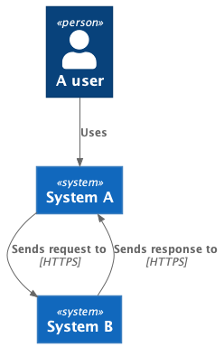

# Diagrams as code

GitHub repository: https://github.com/gratiartis/diagrams-as-code

This project exists as a result of a number of observations when developing software projects and maintaining documentation alongside them.

* Different people use different tools, so if one person develops diagrams with Visio, they are not necessarily editable by anyone else.
* Different people's tastes and skills lead to variability in the appearance of diagrams.
* Changes in binaries such as image formats, are difficult to track.
* Diagrams tend not to have any semantic value.
* The difficulty of maintaining diagrams leads to them diverging from the reality of the project.

Therefore, I would like to apply the following ideas to maintaining documentation.

* If a diagram is easy to maintain, it is more likely to be maintained.
* Editable diagrams should be version controlled just like any other code and documentation.
* Version control of diagrams is much more valuable if they are a readable text format.
* Semantic markup notations are more useful than purely graphical notations.
* Generating diagrams from semantic markup avoids errors and leads to improved consistency.
* Using well-established standards for modelling, helps anyone joining a project.

I have found Asciidoctor particularly valuable as it is based on a simple markdown format, and has some powerful additional features such as the ability to include the content from external files, and to process that content during the document build. Asciidoctor also generates a variety of formats, including HTML and PDF, which can be particualrly useful when serving different audiances. For example, when using a wiki in a web browser, HTML is clean and fast; however when sharing documentation with others, it is often useful to be able to send a PDF.

For further reading, you might find the following influences useful.

* [Thoughtworks Radar - Diagrams as code](https://www.thoughtworks.com/radar/techniques/diagrams-as-code)
* [C4 model](https://c4model.com/) - I have become fond of C4 as a relatively minimal approach to architecture modelling, which is so much more readable than most other architecture diagrams I have seen.


## Examples

The following are some examples of diagrams that have been generated by this project from simple text formats.

### C4

Using PlantUML to generate C4 diagrams uses particularly simple notation.



### BPMN


## Building the project

To see examples of building this, the GitHub repository has [Actions](https://github.com/gratiartis/diagrams-as-code/actions) configured in [.github/workflows/build.yml](https://github.com/gratiartis/diagrams-as-code/blob/main/.github/workflows/build.yml). Look in the page for the most recent build to find the latest generated PDF: `example-doc.pdf`.


### Simple build with a Docker container

If you have Docker Compose installed, and don't want to mess around with installing anything yourself, the following is a quick and easy way to build this PDF.

```
docker-compose run --rm docbuilder ./scripts/build-pdf.sh
```

Take a look in `Dockerfile` to see the tools which are installed. It's based on the official [asciidoctor/docker-asciidoctor](https://hub.docker.com/r/asciidoctor/docker-asciidoctor) image, which already includes tools such as Asciidoctor PDF and Asciidoctor Diagram.


### Pre-requisites

First install [Graphviz](https://graphviz.gitlab.io/about/).
```
# Windows:
choco install graphviz
# Mac:
brew install graphviz
```

Then the NPM packages defined in package.json.
```
npm install
```

If you don't have them installed already, asciidoctor and asciidoctor-pdf can be installed as Gems here:
```
bundle
```

To create a bin stub (a shortcut to bypass using `bundle exec`) for asciidoctor, you may also need to run:

```
bundle binstubs asciidoctor
```


### Build

The example shell scripts provided show how to use the tooling:

* `./scripts/build-pdf.sh` will build a PDF.
* `./scripts/build-html.sh` will build an HTML website.


## Asciidoctor

This project makes use of Asciidoctor to generate rich documentation. [Asciidoctor markdown syntax](https://docs.asciidoctor.org/asciidoc/latest/syntax-quick-reference/) is particularly good for generating nicely formatted HTML and PDF output.

If you install Ruby, a Gemfile is provided here, which installs both Asciidoctor and Aciidoctor Diagram, in which case you can run.


## BPMN diagrams

There are a number of diagrams in the project, using BPMN. You can edit these files using the free [BPMN.IO](https://demo.bpmn.io/) editor, or one of a number of other tools such as [Camunda](https://camunda.com/), [Visual Paradigm](https://online.visual-paradigm.com/diagrams/features/bpmn-tool/), or [Eclipse](https://www.eclipse.org/bpmn2-modeler/).

These use [asciidoctor-diagram](https://asciidoctor.org/docs/asciidoctor-diagram/) to generate the images for embedding in the final document. See the contents of `build.sh` for an example of using this.
